# Canvas

<!-- markdownlint-disable MD010 MD024 MD033 -->

Canvas is a C++ library for creating 2D and 3D scenes and scientific drawings. It aims at begin as simple to use as possible, while providing a comprehensive control of the code. The library is based on modern OpenGL 4.6 and can be integrated with any window system that provides an OpenGL context. Default managers for GLUT and QT are added for convenience.

A python binding, allowing for the library to be called and used via python scripts, is planned for the near future.

Author: Murillo Vinicius Bento Santana

Contact: [murillo.bento-santana@univ-amu.fr](mailto:murillo.bento-santana@univ-amu.fr)

## Setup

### Setup in Windows

The MSVC C++ compiler is used for building and debugging. Be sure to have it [installed](https://visualstudio.microsoft.com/vs/community/) and [available](https://learn.microsoft.com/en-us/visualstudio/ide/reference/command-prompt-powershell?view=vs-2022) in the path. All used external libraries are packed with the code.

Generate an executable (make.exe) that will be used to build the code: `win\make.bat`

### Setup in Unix

The [GNU C++](https://gcc.gnu.org/) compiler and the [GNU Make](https://www.gnu.org/software/make/) tool are used for the build. The [GNU GDB](https://www.sourceware.org/gdb/) debugger is used to debug the code. Be sure to have them installed by running the following commands:

`sudo apt-get install g++`

`sudo apt-get install gdb`

`sudo apt-get install make`

## Build and Run

Build the debug version of the code: `make`

Run the debug version of the code: `make run`

Clean the debug version of the code: `make clean`

To build, run or clean the release version, simply add the option `m=r` to the make commands above.

## Debug

### Debug in Windows

Debug the code: `make debug`

### Debug in Unix

Debug the code: `gdb ./dist/debug/test.out`

## Objects

A number of pre-defined objects (listed below) are defined for convenience. The user has also the possibility of creating its own objects, derived of the base class `canvas::objects::Object`. Objects can also be grouped via the base class `canvas::objects::Group`.

| 0D:   | 1D:      | 2D:      | 3D:      | Textures: |
|-------|----------|----------|----------|-----------|
| Point | Arc      | Quad     | Cube     | Text      |
|       | Line     | Circle   | Sphere   | Latex     |
|       | Curve    | Grid 2D  | Cylinder | Image     |
|       | Arrow    | Grid 3D  |          |           |
|       | Spline   | Polygon  |          |           |
|       | Polyline | Surface  |          |           |
|       |          | Triangle |          |           |

## Textures

### Text

Text can be added to the scene via the class `canvas::objects::Text`. Text support is made available via the [freetype library](http://freetype.org/). Fonts are loaded from true type font files (`.ttf`). In windows, these files are usually located under `C:\Windows\Fonts`, while on Unix they are usually located under `/usr/share/fonts`.

### Latex

Latex can be added to the scene via the class `canvas::objects::Latex`. Latex support is made available via the `pdflatex TeX compiler` distributed by the [MiKTeX package](https://miktex.org/). Make sure to have it installed and available in the path before using the Latex class.

### Images

Images can be added to the scene via the class `canvas::objects::Image`. Image support is made available via the [stb library](https://github.com/nothings/stb). Screenshots can also be converted to images via the `canvas::Scene` class.

## Examples

### 0D

	
Points

	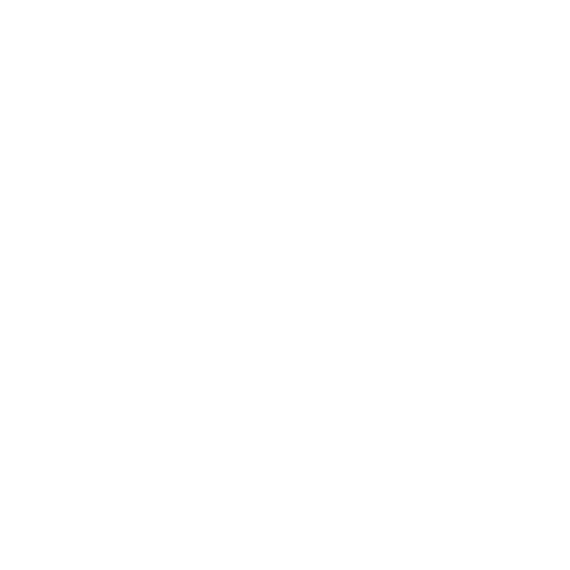

	//canvas
	#include "Canvas/lib/inc/Scene/Scene.hpp"
	#include "Canvas/lib/inc/Objects/0D/Point.hpp"

	void points(canvas::Scene* scene)
	{
		//data
		const unsigned n = 10;
		const float r = 1.0f / n;
		//objects
		for(unsigned i = 0; i < n; i++)
		{
			for(unsigned j = 0; j < n; j++)
			{
				const float x1 = 2 * r * j + r - 1;
				const float x2 = 2 * r * i + r - 1;
				scene->add_object(new canvas::objects::Point);
				((canvas::objects::Point*) scene->object(n * i + j))->position({x1, x2, 0});
			}
		}
	}

### 1D

	
Arcs

	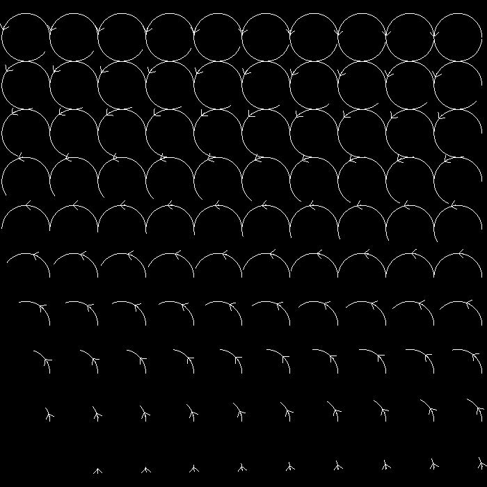

	//std
	#include <cmath>

	//canvas
	#include "Canvas/lib/inc/Scene/Scene.hpp"
	#include "Canvas/lib/inc/Objects/1D/Arc.hpp"
	#include "Canvas/lib/inc/Objects/1D/Arrow.hpp"

	void arcs(canvas::Scene* scene)
	{
		//data
		const unsigned n = 10;
		const float r = 1.0f / n;
		//objects
		for(unsigned i = 0; i < n; i++)
		{
			for(unsigned j = 0; j < n; j++)
			{
				scene->add_object(new canvas::objects::Arc);
				((canvas::objects::Arc*) scene->object(n * i + j))->radius(r);
				((canvas::objects::Arc*) scene->object(n * i + j))->angle(0, 0);
				((canvas::objects::Arc*) scene->object(n * i + j))->add_arrow(0.5, true);
				((canvas::objects::Arc*) scene->object(n * i + j))->color_fill({0, 0, 1});
				((canvas::objects::Arc*) scene->object(n * i + j))->color_stroke({1, 1, 1});
				((canvas::objects::Arc*) scene->object(n * i + j))->arrow(0)->width(r / 5);
				((canvas::objects::Arc*) scene->object(n * i + j))->arrow(0)->height(r / 5);
				((canvas::objects::Arc*) scene->object(n * i + j))->angle(1, 2 * M_PI * float(n * i + j) / n / n);
				((canvas::objects::Arc*) scene->object(n * i + j))->shift({2 * r * j + r - 1, 2 * r * i + r - 1, 0});
			}
		}
	}

	
Lines

	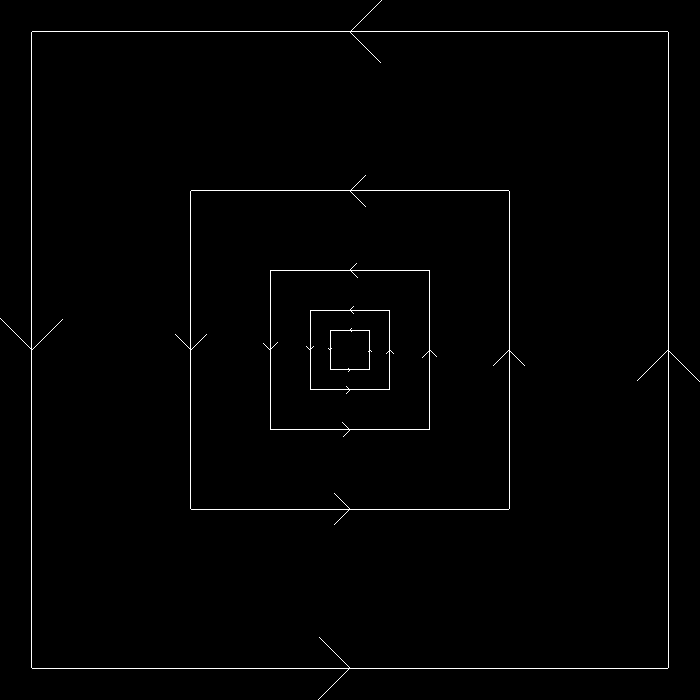

	//canvas
	#include "Canvas/lib/inc/Scene/Scene.hpp"
	#include "Canvas/lib/inc/Objects/1D/Line.hpp"
	#include "Canvas/lib/inc/Objects/1D/Arrow.hpp"

	void lines(canvas::Scene* scene)
	{
		//data
		float s = 0.90f;
		const unsigned n = 5;
		const float x1[] = {-1, +1, +1, -1};
		const float x2[] = {-1, -1, +1, +1};
		//objects
		for(unsigned i = 0; i < n; i++)
		{
			for(unsigned j = 0; j < 4; j++)
			{
				scene->add_object(new canvas::objects::Line);
				((canvas::objects::Line*) scene->object(4 * i + j))->add_arrow(0.50f, true);
				((canvas::objects::Line*) scene->object(4 * i + j))->arrow(0)->width(s / 10);
				((canvas::objects::Line*) scene->object(4 * i + j))->arrow(0)->height(s / 10);
				((canvas::objects::Line*) scene->object(4 * i + j))->point(0, {s * x1[(j + 0) % 4], s * x2[(j + 0) % 4], 0});
				((canvas::objects::Line*) scene->object(4 * i + j))->point(1, {s * x1[(j + 1) % 4], s * x2[(j + 1) % 4], 0});
			}
			s /= 2;
		}
	}

	
Arrows

	

	//canvas
	#include "Canvas/lib/inc/Scene/Scene.hpp"
	#include "Canvas/lib/inc/Objects/1D/Line.hpp"
	#include "Canvas/lib/inc/Objects/1D/Arrow.hpp"

	void arrows(canvas::Scene* scene)
	{
		//objects
		canvas::objects::Line* a1 = new canvas::objects::Line;
		canvas::objects::Line* a2 = new canvas::objects::Line;
		canvas::objects::Line* a3 = new canvas::objects::Line;
		//setup
		a1->add_arrow(1, true);
		a2->add_arrow(1, true);
		a3->add_arrow(1, true);
		a1->point(0, {0, 0, 0});
		a1->point(1, {1, 0, 0});
		a2->point(0, {0, 0, 0});
		a2->point(1, {0, 1, 0});
		a3->point(0, {0, 0, 0});
		a3->point(1, {0, 0, 1});
		a1->color_stroke({1, 0, 0});
		a2->color_stroke({0, 1, 0});
		a3->color_stroke({0, 0, 1});
		//scene
		scene->add_object(a1);
		scene->add_object(a2);
		scene->add_object(a3);
	}

	
Curves

	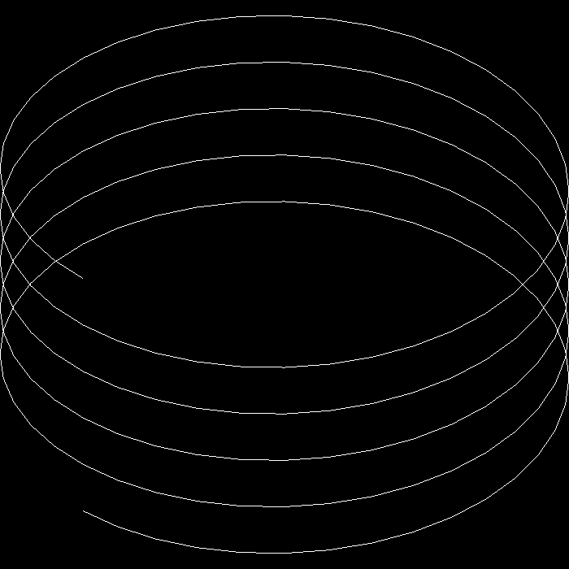

	//std
	#include <cmath>

	//canvas
	#include "Canvas/lib/inc/Scene/Scene.hpp"
	#include "Canvas/lib/inc/Objects/1D/Curve.hpp"
	#include "Canvas/lib/inc/Objects/1D/Arrow.hpp"

	void curves(canvas::Scene* scene)
	{
		//data
		const float r = 1.0f;
		const unsigned nt = 5;
		const unsigned nm = 200;
		//curve
		canvas::objects::Curve* curve = new canvas::objects::Curve;
		curve->position([r] (float s){ 
			const float v1 = r * cosf(2 * nt * M_PI * s);
			const float v2 = r * sinf(2 * nt * M_PI * s);
			return canvas::vec3(v1, v2, s);
		});
		curve->gradient([r] (float s){ 
			const float v1 = -2 * nt * M_PI * r * sinf(2 * nt * M_PI * s);
			const float v2 = +2 * nt * M_PI * r * cosf(2 * nt * M_PI * s);
			return canvas::vec3(v1, v2, 1);
		});
		curve->hessian([r] (float s){ 
			const float v1 = -4 * nt * nt * M_PI * M_PI * r * cosf(2 * nt * M_PI * s);
			const float v2 = -4 * nt * nt * M_PI * M_PI * r * sinf(2 * nt * M_PI * s);
			return canvas::vec3(v1, v2, 0);
		});
		curve->mesh(nm);
		scene->add_object(curve);
	}

	
Splines

	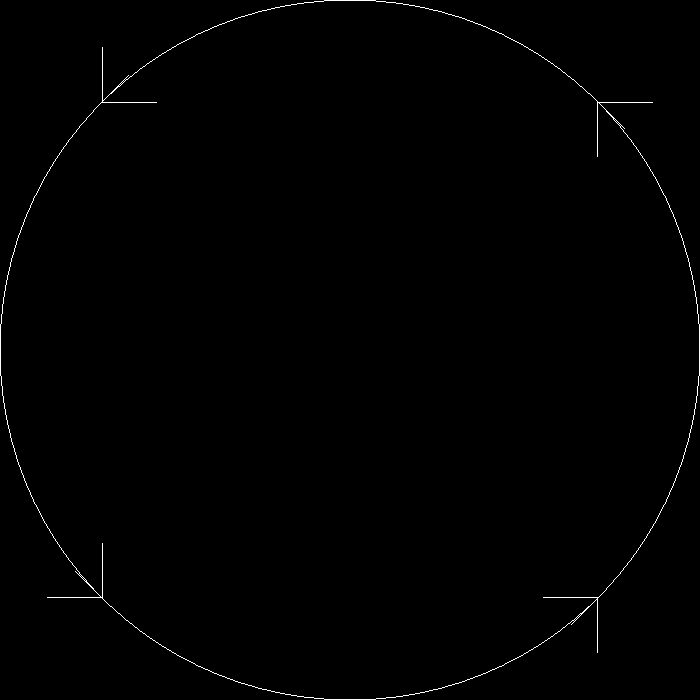

	//canvas
	#include "Canvas/lib/inc/Scene/Scene.hpp"
	#include "Canvas/lib/inc/Objects/1D/Arrow.hpp"
	#include "Canvas/lib/inc/Objects/1D/Spline.hpp"

	void splines(canvas::Scene* scene)
	{
		//data
		const float r = 9.00e-01;
		const float s = 5.00e-01;
		canvas::objects::Spline* spline = new canvas::objects::Spline;
		//spline
		spline->mesh(100);
		spline->point(0, {+r, 0, 0});
		spline->point(1, {0, +r, 0});
		spline->add_point({-r, 0, 0});
		spline->add_point({0, -r, 0});
		spline->add_point({+r, 0, 0});
		spline->add_arrow(0.50f, true);
		spline->add_arrow(1.50f, true);
		spline->add_arrow(2.50f, true);
		spline->add_arrow(3.50f, true);
		spline->arrow(0)->width(0.10f);
		spline->arrow(1)->width(0.10f);
		spline->arrow(2)->width(0.10f);
		spline->arrow(3)->width(0.10f);
		spline->arrow(0)->height(0.10f);
		spline->arrow(1)->height(0.10f);
		spline->arrow(2)->height(0.10f);
		spline->arrow(3)->height(0.10f);
		spline->control(0, 1, {+r, +s, 0});
		spline->control(1, 0, {+s, +r, 0});
		spline->control(1, 1, {-s, +r, 0});
		spline->control(2, 0, {-r, +s, 0});
		spline->control(2, 1, {-r, -s, 0});
		spline->control(3, 0, {-s, -r, 0});
		spline->control(3, 1, {+s, -r, 0});
		spline->control(4, 0, {+r, -s, 0});
		//scene
		scene->add_object(spline);
	}

	
Polylines

	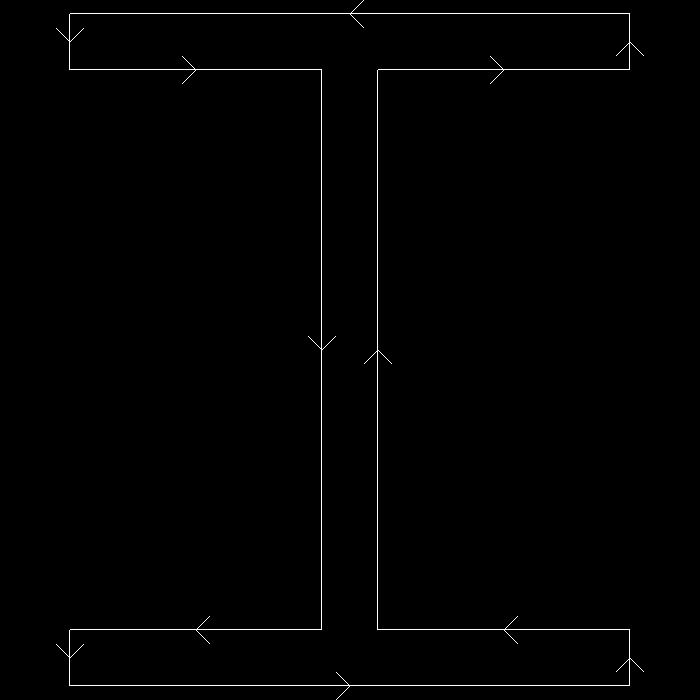

	//canvas
	#include "Canvas/lib/inc/Scene/Scene.hpp"
	#include "Canvas/lib/inc/Objects/1D/Arrow.hpp"
	#include "Canvas/lib/inc/Objects/1D/Polyline.hpp"

	void polylines(canvas::Scene* scene)
	{
		//data
		const float w = 1.00e-01;
		const float h = 1.00e-01;
		const float t = 1.00e-02;
		canvas::objects::Polyline* polyline;
		//spline
		polyline = new canvas::objects::Polyline;
		polyline->points().push_back({-w / 2, -h / 2 - t, 0});
		polyline->points().push_back({+w / 2, -h / 2 - t, 0});
		polyline->points().push_back({+w / 2, -h / 2, 0});
		polyline->points().push_back({+t / 2, -h / 2, 0});
		polyline->points().push_back({+t / 2, +h / 2, 0});
		polyline->points().push_back({+w / 2, +h / 2, 0});
		polyline->points().push_back({+w / 2, +h / 2 + t, 0});
		polyline->points().push_back({-w / 2, +h / 2 + t, 0});
		polyline->points().push_back({-w / 2, +h / 2, 0});
		polyline->points().push_back({-t / 2, +h / 2, 0});
		polyline->points().push_back({-t / 2, -h / 2, 0});
		polyline->points().push_back({-w / 2, -h / 2, 0});
		polyline->points().push_back({-w / 2, -h / 2 - t, 0});
		//arrows
		for(unsigned i = 0; i < 12; i++)
		{
			polyline->add_arrow(i + 0.5f, true);
			polyline->arrow(i)->width(2.50e-03);
			polyline->arrow(i)->height(2.50e-03);
		}
		//scene
		scene->add_object(polyline);
	}

### 2D

	
Quads

	

	//canvas
	#include "Canvas/lib/inc/Scene/Scene.hpp"
	#include "Canvas/lib/inc/Objects/2D/Quad.hpp"

	void quads(canvas::Scene* scene)
	{
		//data
		const unsigned n = 40;
		const float s = 2.0f / n;
		//objects
		for(unsigned i = 0; i < n; i++)
		{
			for(unsigned j = 0; j < n; j++)
			{
				scene->add_object(new canvas::objects::Quad);
				((canvas::objects::Quad*) scene->object(n * i + j))->color_fill({0, 0, 1});
				((canvas::objects::Quad*) scene->object(n * i + j))->color_stroke({1, 1, 1});
				((canvas::objects::Quad*) scene->object(n * i + j))->point(0, {(j + 0) * s - 1, (i + 0) * s - 1, 0});
				((canvas::objects::Quad*) scene->object(n * i + j))->point(1, {(j + 1) * s - 1, (i + 0) * s - 1, 0});
				((canvas::objects::Quad*) scene->object(n * i + j))->point(2, {(j + 1) * s - 1, (i + 1) * s - 1, 0});
				((canvas::objects::Quad*) scene->object(n * i + j))->point(3, {(j + 0) * s - 1, (i + 1) * s - 1, 0});
			}
		}
	}

	
Circles

	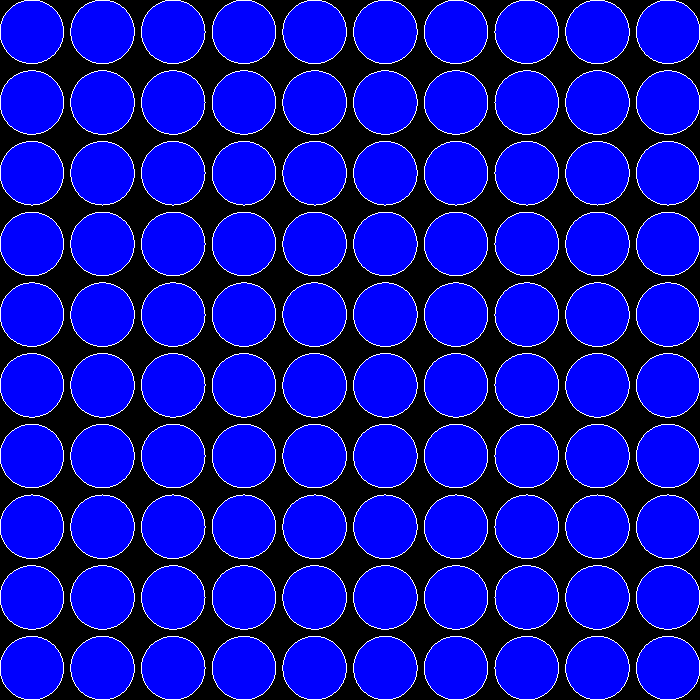

	//canvas
	#include "Canvas/lib/inc/Scene/Scene.hpp"
	#include "Canvas/lib/inc/Objects/2D/Circle.hpp"

	void circles(canvas::Scene* scene)
	{
		//data
		const unsigned n = 10;
		const float r = 1.0f / n;
		//objects
		for(unsigned i = 0; i < n; i++)
		{
			for(unsigned j = 0; j < n; j++)
			{
				scene->add_object(new canvas::objects::Circle);
				((canvas::objects::Circle*) scene->object(n * i + j))->radius(0.9 * r);
				((canvas::objects::Circle*) scene->object(n * i + j))->color_fill({0, 0, 1});
				((canvas::objects::Circle*) scene->object(n * i + j))->color_stroke({1, 1, 1});
				((canvas::objects::Circle*) scene->object(n * i + j))->shift({2 * r * j + r - 1, 2 * r * i + r - 1, 0});
			}
		}
	}

	
Grids 2D

	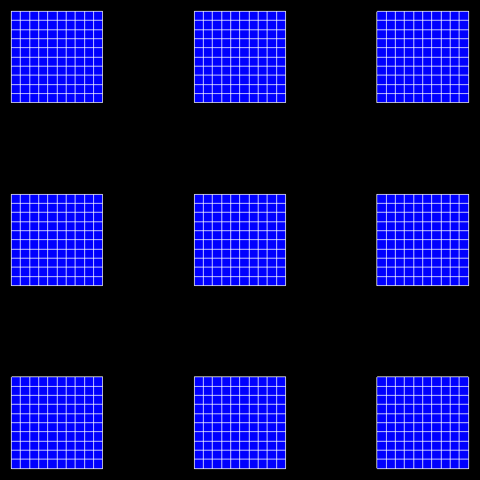

	//canvas
	#include "Canvas/lib/inc/Scene/Scene.hpp"
	#include "Canvas/lib/inc/Objects/2D/Grid_2D.hpp"

	void grid_2D(canvas::Scene* scene)
	{
		//data
		const unsigned n = 10;
		const float s = 1.0f / n;
		//objects
		for(unsigned i = 0; i < n; i++)
		{
			for(unsigned j = 0; j < n; j++)
			{
				const float x1 = 2 * j * s - 1 + s;
				const float x2 = 2 * i * s - 1 + s;
				scene->add_object(new canvas::objects::Grid_2D);
				((canvas::objects::Grid_2D*) scene->object(n * i + j))->scale(0.5 * s);
				((canvas::objects::Grid_2D*) scene->object(n * i + j))->shift({x1, x2, 0});
				((canvas::objects::Grid_2D*) scene->object(n * i + j))->color_fill({0, 0, 1});
				((canvas::objects::Grid_2D*) scene->object(n * i + j))->color_stroke({1, 1, 1});
			}
		}
	}

	
Grids 3D

	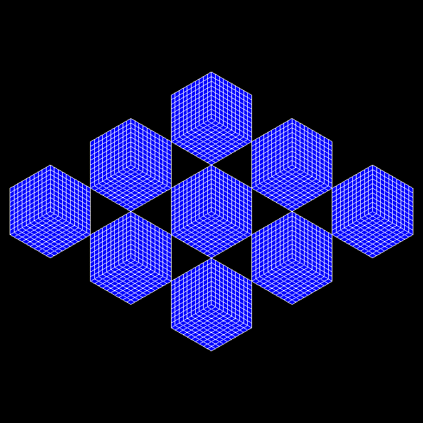

	//canvas
	#include "Canvas/lib/inc/Scene/Scene.hpp"
	#include "Canvas/lib/inc/Objects/2D/Grid_3D.hpp"

	void grid_3D(canvas::Scene* scene)
	{
		//data
		const unsigned n = 10;
		const float s = 1.0f / n;
		//objects
		for(unsigned i = 0; i < n; i++)
		{
			for(unsigned j = 0; j < n; j++)
			{
				const float x1 = 2 * j * s - 1 + s;
				const float x2 = 2 * i * s - 1 + s;
				scene->add_object(new canvas::objects::Grid_3D);
				((canvas::objects::Grid_3D*) scene->object(n * i + j))->scale(0.5 * s);
				((canvas::objects::Grid_3D*) scene->object(n * i + j))->shift({x1, x2, 0});
				((canvas::objects::Grid_3D*) scene->object(n * i + j))->color_fill({0, 0, 1});
				((canvas::objects::Grid_3D*) scene->object(n * i + j))->color_stroke({1, 1, 1});
			}
		}
	}

	
Surfaces

	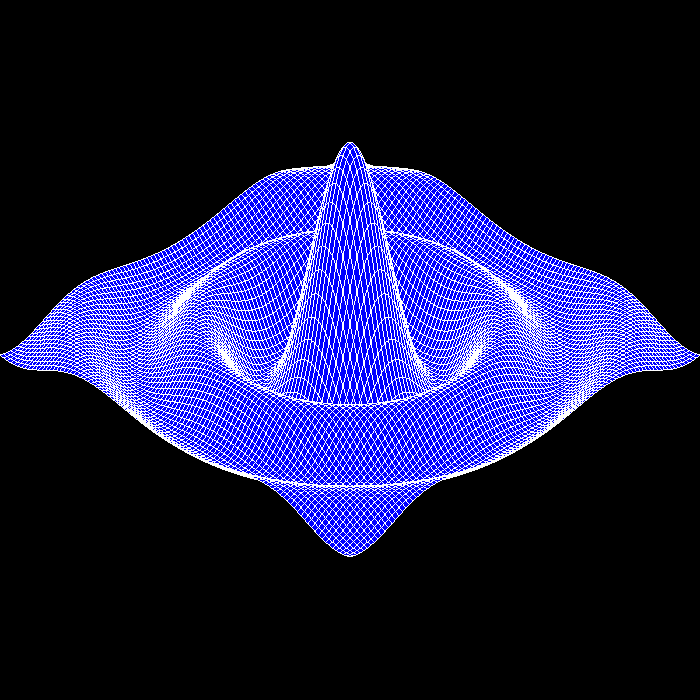

	//canvas
	#include "Canvas/lib/inc/Scene/Scene.hpp"
	#include "Canvas/lib/inc/Objects/2D/Surface.hpp"

	void surfaces(canvas::Scene* scene)
	{
		//data
		canvas::objects::Surface* surface = new canvas::objects::Surface;
		//surface
		surface->mesh(0, 100);
		surface->mesh(1, 100);
		surface->domain(0, 0, -1);
		surface->domain(0, 1, +1);
		surface->domain(1, 0, -1);
		surface->domain(1, 1, +1);
		surface->color_fill({0, 0, 1});
		surface->position([] (float s1, float s2) { 
			const float r = 4 * M_PI * sqrtf(s1 * s1 + s2 * s2);
			return canvas::vec3(s1, s2, fabsf(r) < 1e-5 ? 1 : sinf(r) / r); 
		});
		//light
		scene->light().position({0, 0, 2});
		scene->light().update_shaders();
		//scene
		scene->add_object(surface);
	}

	
Polygons

	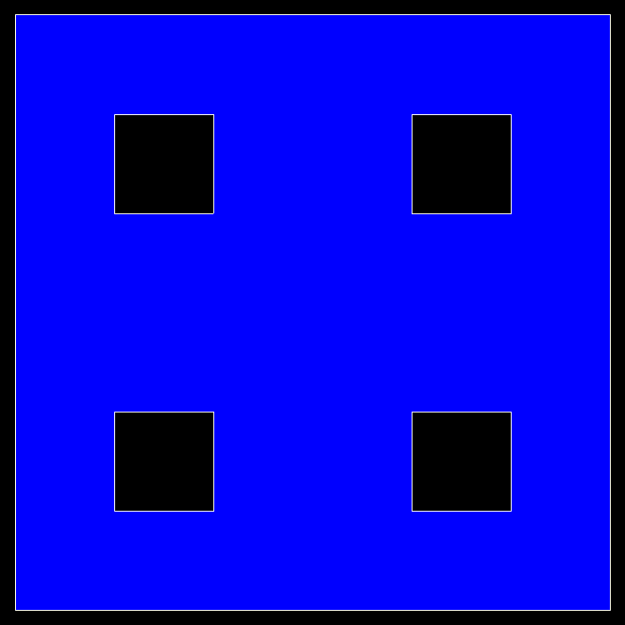

	//canvas
	#include "Canvas/lib/inc/Scene/Scene.hpp"
	#include "Canvas/lib/inc/Objects/2D/Polygon.hpp"

	void polygons(canvas::Scene* scene)
	{
		//data
		canvas::objects::Polygon* polygon = new canvas::objects::Polygon;
		//polygon
		polygon->loops().push_back( 4);
		polygon->loops().push_back( 8);
		polygon->loops().push_back(12);
		polygon->loops().push_back(16);
		polygon->loops().push_back(20);
		polygon->color_fill({0, 0, 1});
		polygon->points().push_back({-3, -3});
		polygon->points().push_back({+3, -3});
		polygon->points().push_back({+3, +3});
		polygon->points().push_back({-3, +3});
		polygon->points().push_back({-2, -2});
		polygon->points().push_back({-2, -1});
		polygon->points().push_back({-1, -1});
		polygon->points().push_back({-1, -2});
		polygon->points().push_back({+1, -2});
		polygon->points().push_back({+1, -1});
		polygon->points().push_back({+2, -1});
		polygon->points().push_back({+2, -2});
		polygon->points().push_back({+1, +1});
		polygon->points().push_back({+1, +2});
		polygon->points().push_back({+2, +2});
		polygon->points().push_back({+2, +1});
		polygon->points().push_back({-2, +1});
		polygon->points().push_back({-2, +2});
		polygon->points().push_back({-1, +2});
		polygon->points().push_back({-1, +1});
		//scene
		scene->add_object(polygon);
	}

	
Triangles

	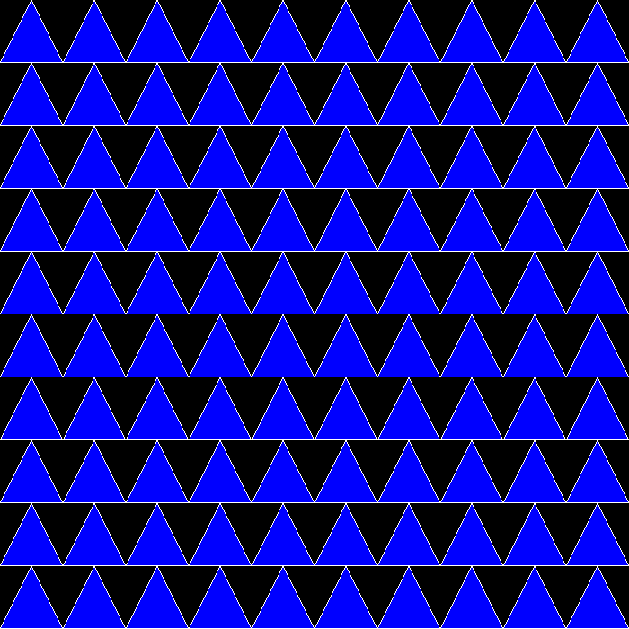

	//canvas
	#include "Canvas/lib/inc/Scene/Scene.hpp"
	#include "Canvas/lib/inc/Objects/2D/Triangle.hpp"

	void triangles(canvas::Scene* scene)
	{
		//data
		const unsigned n = 10;
		const float r = 1.0f / n;
		//objects
		for(unsigned i = 0; i < n; i++)
		{
			for(unsigned j = 0; j < n; j++)
			{
				scene->add_object(new canvas::objects::Triangle);
				((canvas::objects::Triangle*) scene->object(n * i + j))->scale(r);
				((canvas::objects::Triangle*) scene->object(n * i + j))->color_fill({0, 0, 1});
				((canvas::objects::Triangle*) scene->object(n * i + j))->point(0, {-1, -1, 0});
				((canvas::objects::Triangle*) scene->object(n * i + j))->point(1, {+1, -1, 0});
				((canvas::objects::Triangle*) scene->object(n * i + j))->point(2, {+0, +1, 0});
				((canvas::objects::Triangle*) scene->object(n * i + j))->shift({2 * r * j + r - 1, 2 * r * i + r - 1, 0});
			}
		}
	}

### 3D

	
Cubes

	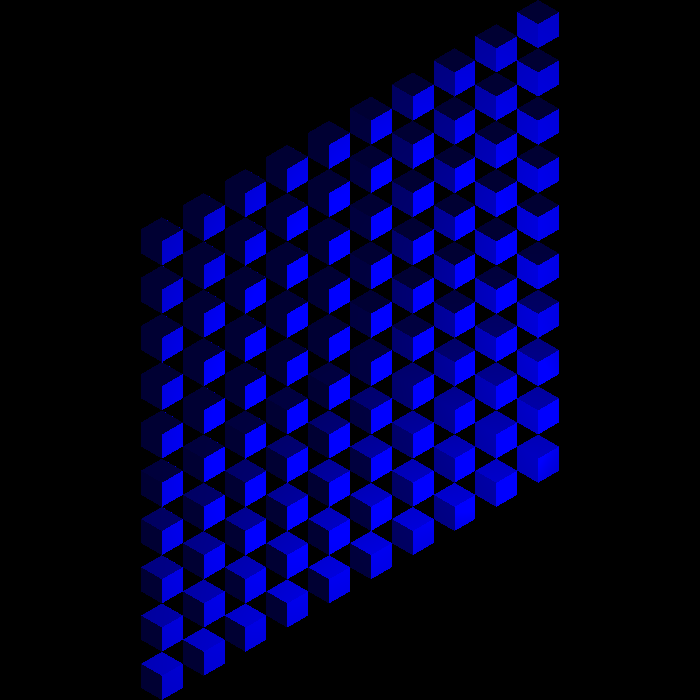

	//canvas
	#include "Canvas/lib/inc/Scene/Scene.hpp"
	#include "Canvas/lib/inc/Objects/3D/Cube.hpp"

	void cubes(canvas::Scene* scene)
	{
		//data
		const unsigned n = 10;
		const float s = 1.0f / n;
		//objects
		for(unsigned i = 0; i < n; i++)
		{
			for(unsigned j = 0; j < n; j++)
			{
				const float x1 = 2 * j * s - 1 + s;
				const float x2 = 2 * i * s - 1 + s;
				scene->add_object(new canvas::objects::Cube);
				((canvas::objects::Cube*) scene->object(n * i + j))->scale(s);
				((canvas::objects::Cube*) scene->object(n * i + j))->shift({x1, x2, 0});
				((canvas::objects::Cube*) scene->object(n * i + j))->color_fill({0.0f, 0.0f, 1.0f});
				((canvas::objects::Cube*) scene->object(n * i + j))->color_stroke({1.0f, 1.0f, 1.0f});
			}
		}
	}

	
Spheres

	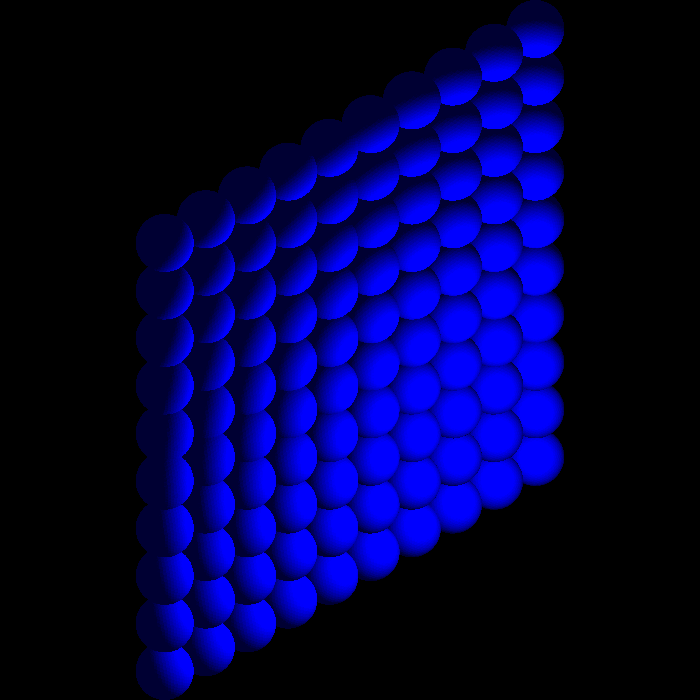

	//canvas
	#include "Canvas/lib/inc/Scene/Scene.hpp"
	#include "Canvas/lib/inc/Objects/3D/Sphere.hpp"

	void spheres(canvas::Scene* scene)
	{
		//data
		const unsigned n = 10;
		const float s = 1.0f / n;
		//objects
		for(unsigned i = 0; i < n; i++)
		{
			for(unsigned j = 0; j < n; j++)
			{
				const float x1 = 2 * j * s - 1 + s;
				const float x2 = 2 * i * s - 1 + s;
				scene->add_object(new canvas::objects::Sphere);
				((canvas::objects::Sphere*) scene->object(n * i + j))->scale(s);
				((canvas::objects::Sphere*) scene->object(n * i + j))->shift({x1, x2, 0});
				((canvas::objects::Sphere*) scene->object(n * i + j))->color_fill({0.0f, 0.0f, 1.0f});
				((canvas::objects::Sphere*) scene->object(n * i + j))->color_stroke({1.0f, 1.0f, 1.0f});
			}
		}
	}

	
Cylinders

	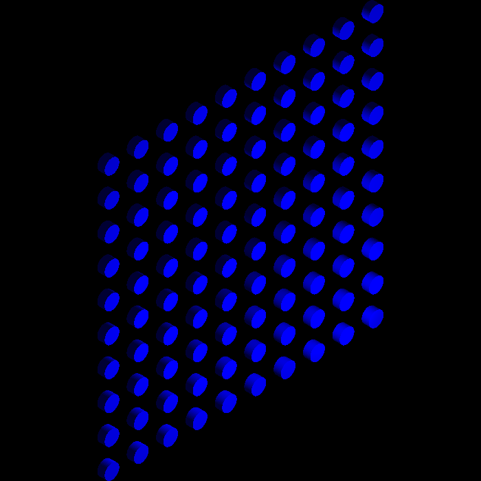

	//canvas
	#include "Canvas/lib/inc/Scene/Scene.hpp"
	#include "Canvas/lib/inc/Objects/3D/Cylinder.hpp"

	void cylinders(canvas::Scene* scene)
	{
		//data
		const unsigned n = 10;
		const float s = 1.0f / n;
		//objects
		for(unsigned i = 0; i < n; i++)
		{
			for(unsigned j = 0; j < n; j++)
			{
				const float x1 = 2 * j * s - 1 + s;
				const float x2 = 2 * i * s - 1 + s;
				scene->add_object(new canvas::objects::Cylinder);
				((canvas::objects::Cylinder*) scene->object(n * i + j))->scale(s / 2);
				((canvas::objects::Cylinder*) scene->object(n * i + j))->shift({x1, x2, 0});
				((canvas::objects::Cylinder*) scene->object(n * i + j))->color_fill({0.0f, 0.0f, 1.0f});
				((canvas::objects::Cylinder*) scene->object(n * i + j))->color_stroke({1.0f, 1.0f, 1.0f});
			}
		}
	}

### Textures

	
Text

	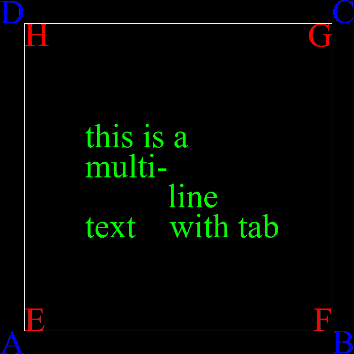

	//canvas
	#include "Canvas/lib/inc/Scene/Scene.hpp"
	#include "Canvas/lib/inc/Objects/2D/Quad.hpp"
	#include "Canvas/lib/inc/Objects/Image/Text.hpp"

	//static
	static const float x[] = {-1, -1, +1, -1, +1, +1, -1, +1};
	static const char* c[] = {"A", "B", "C", "D", "E", "F", "G", "H"};
	static const char* a[] = {"NE", "NW", "SW", "SE", "SW", "SE", "NE", "NW"};

	void text(canvas::Scene* scene)
	{
		//fonts
		scene->add_font("times");
		//objects
		canvas::objects::Quad* quad;
		canvas::objects::Text* text[9];
		for(unsigned i = 0; i < 9; i++)
		{
			scene->add_object(text[i] = new canvas::objects::Text);
		}
		scene->add_object(quad = new canvas::objects::Quad);
		//quad
		quad->fill(false);
		quad->point(0, {-1, -1, 0});
		quad->point(1, {+1, -1, 0});
		quad->point(2, {+1, +1, 0});
		quad->point(3, {-1, +1, 0});
		//text
		text[4]->size(0.2f);
		text[4]->anchor("CC");
		text[4]->position({0, 0, 0});
		text[4]->color_fill({0, 1, 0});
		for(unsigned i = 0; i < 4; i++)
		{
			text[i + 0]->size(0.2f);
			text[i + 5]->size(0.2f);
			text[i + 0]->text(c[i + 0]);
			text[i + 5]->text(c[i + 4]);
			text[i + 0]->anchor(a[i + 0]);
			text[i + 5]->anchor(a[i + 4]);
			text[i + 0]->color_fill({0, 0, 1});
			text[i + 5]->color_fill({1, 0, 0});
			text[i + 0]->position({x[2 * i + 0], x[2 * i + 1], 0});
			text[i + 5]->position({x[2 * i + 0], x[2 * i + 1], 0});
		}
		text[4]->text("this is a\nmulti-\vline\ntext\twith tab");
	}

	
Latex

	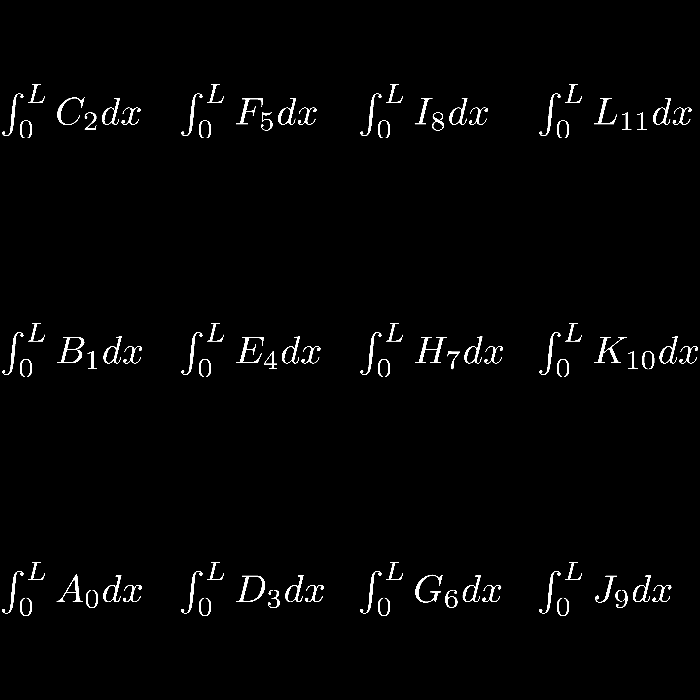

	//canvas
	#include "Canvas/lib/inc/Scene/Scene.hpp"
	#include "Canvas/lib/inc/Objects/Image/Latex.hpp"

	void latex(canvas::Scene* scene)
	{
		//data
		char source[200];
		canvas::objects::Latex* latex;
		//images
		for(unsigned i = 0; i < 12; i++)
		{
			sprintf(source, "$ \\int_{0}^{L} %c_{%d} dx $", i + 65, i);
			scene->add_latex(source);
		}
		//objects
		for(unsigned i = 0; i < 4; i++)
		{
			for(unsigned j = 0; j < 3; j++)
			{
				latex = new canvas::objects::Latex;
				latex->size(0.15);
				latex->anchor("SW");
				latex->index(3 * i + j);
				latex->shift({2 * float(i) / 4 - 1, 2 * float(j) / 3 - 1, 0});
				scene->add_object(latex);
			}
		}
	}

	
Images

	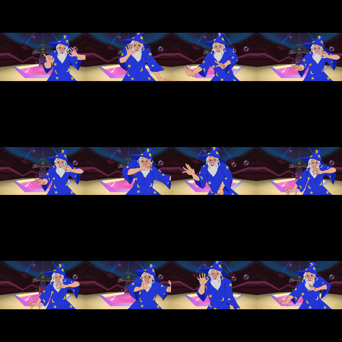

	//canvas
	#include "Canvas/lib/inc/Scene/Scene.hpp"
	#include "Canvas/lib/inc/Objects/Image/Image.hpp"

	void images(canvas::Scene* scene)
	{
		//data
		char path[200];
		const unsigned ni = 10;
		canvas::objects::Image* image;
		//images
		for(unsigned i = 0; i < 12; i++)
		{
			sprintf(path, "data/images/wizard-%d.png", i % ni);
			scene->add_image(path);
		}
		//objects
		for(unsigned i = 0; i < 4; i++)
		{
			for(unsigned j = 0; j < 3; j++)
			{
				image = new canvas::objects::Image;
				image->size(0.5);
				image->anchor("CC");
				image->index(3 * i + j);
				image->shift({(2 * float(i) + 1) / 4 - 1, (2 * float(j) + 1) / 3 - 1, 0});
				scene->add_object(image);
			}
		}
	}

### Light

	
Moving

	

	
Rotating

	

	
Diffuse

	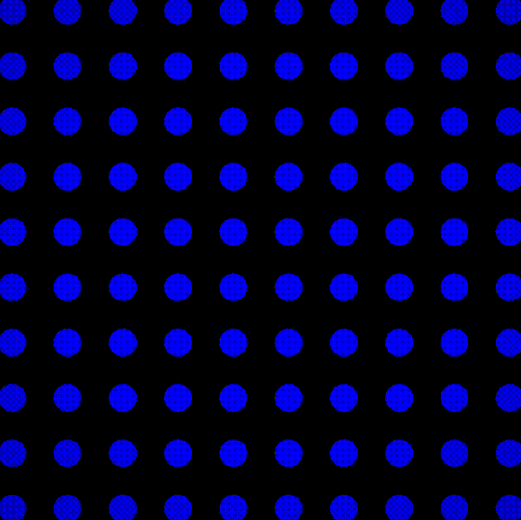

	
Specular

	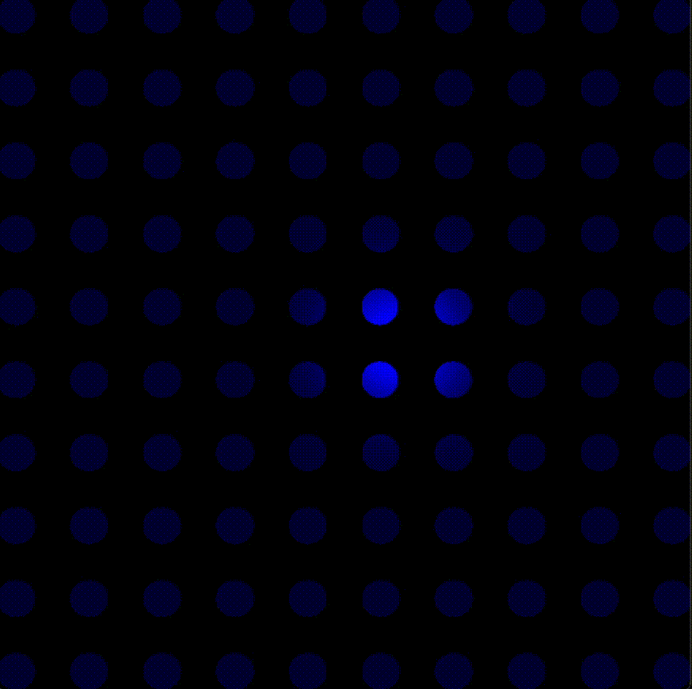

### Extra

	
Tensegrity chair

	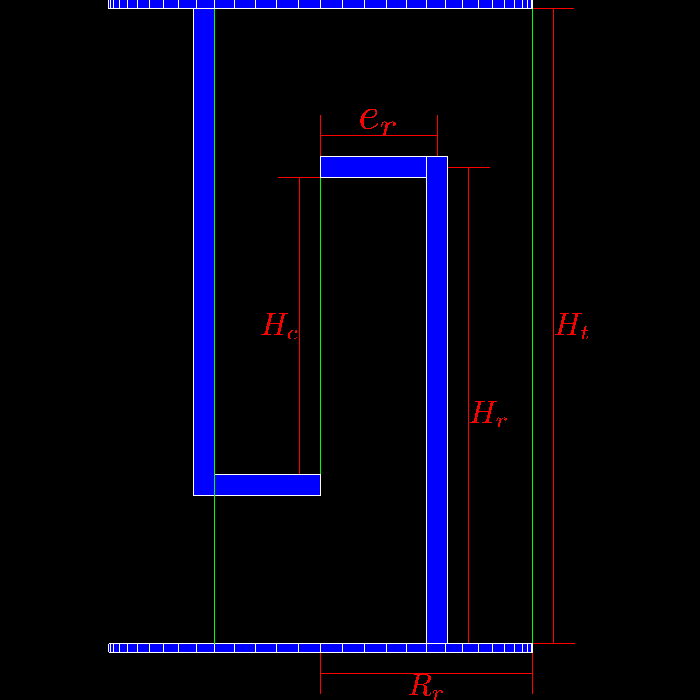

	//std
	#include <cmath>

	//canvas
	#include "Canvas/lib/inc/Objects/1D/Line.hpp"
	#include "Canvas/lib/inc/Objects/3D/Cube.hpp"
	#include "Canvas/lib/inc/Objects/1D/Arrow.hpp"
	#include "Canvas/lib/inc/Objects/3D/Cylinder.hpp"
	#include "Canvas/lib/inc/Objects/Image/Latex.hpp"

	//data
	static const unsigned nc = 3;
	static const float e = 5.50e-02;
	static const float tr = 4.00e-03;
	static const float tc = 1.00e-02;
	static const float Rr = 1.00e-01;
	static const float Ht = 3.00e-01;
	static const float Hc = 1.50e-01;
	static const float Hr = (Ht + Hc) / 2;

	static void rigid(canvas::Scene* scene)
	{
		//data
		canvas::objects::Cube* links[4];
		canvas::objects::Cylinder* bases[2];
		const canvas::vec3 s2(e - tc / 2, tc, tc);
		const canvas::vec3 s1(tc, tc, Hr + tc / 2);
		const canvas::vec3 x1(e, 0, Hr / 2 + tc / 4 + tr);
		const canvas::vec3 x2(e / 2 - tc / 4, 0, Hr + tr);
		for(unsigned i = 0; i < 4; i++) links[i] = new canvas::objects::Cube;
		for(unsigned i = 0; i < 2; i++) bases[i] = new canvas::objects::Cylinder;
		//bases
		for(unsigned i = 0; i < 2; i++)
		{
			bases[i]->radius(Rr);
			bases[i]->height(tr);
			bases[i]->color_fill({0, 0, 1});
			bases[i]->shift({0, 0, tr / 2});
			scene->add_object(bases[i]);
		}
		//links
		for(unsigned i = 0; i < 2; i++)
		{
			links[i + 0]->color_fill({0, 0, 1});
			links[i + 2]->color_fill({0, 0, 1});
			links[i + 0]->sizes(i == 0 ? s1 : s2);
			links[i + 2]->sizes(i == 0 ? s1 : s2);
			links[i + 0]->shift(i == 0 ? x1 : x2);
			links[i + 2]->shift(i == 0 ? x1 : x2);
			scene->add_object(links[i + 0]);
			scene->add_object(links[i + 2]);
		}
		//upper
		canvas::objects::Object* upper[] = {bases[1], links[2], links[3]};
		for(canvas::objects::Object* object : upper)
		{
			object->rotate({0, 0, tr / 2}, {0, 0, M_PI});
			object->rotate({0, 0, tr / 2}, {M_PI, 0, 0});
			object->shift({0, 0, Ht + tr});
		}
	}
	static void cables(canvas::Scene* scene)
	{
		//data
		canvas::objects::Line* cables[nc + 1];
		for(unsigned i = 0; i <= nc; i++) cables[i] = new canvas::objects::Line;
		//cables
		for(unsigned i = 0; i <= nc; i++)
		{
			if(i == nc)
			{
				cables[i]->point(0, {0, 0, Hr - tc / 2 + tr});
				cables[i]->point(1, {0, 0, Ht - Hr + tc / 2 + tr});
			}
			else
			{
				cables[i]->point(0, {Rr * cosf(2 * M_PI * i / nc), Rr * sinf(2 * M_PI * i / nc), tr});
				cables[i]->point(1, {Rr * cosf(2 * M_PI * i / nc), Rr * sinf(2 * M_PI * i / nc), Ht + tr});
			}
			cables[i]->color_stroke({0, 1, 0});
			scene->add_object(cables[i]);
		}
	}
	static void labels(canvas::Scene* scene)
	{
		//latex
		scene->add_latex("$ e_r $");
		scene->add_latex("$ H_c $");
		scene->add_latex("$ H_t $");
		scene->add_latex("$ H_r $");
		scene->add_latex("$ R_r $");
		//data
		canvas::objects::Latex* labels[5];
		const canvas::Anchor a[] = {"SC", "CE", "CW", "CW", "NC"};
		for(unsigned i = 0; i < 5; i++) labels[i] = new canvas::objects::Latex;
		const canvas::vec3 x[] = {
			{e / 2, 0, tr + Hr + 3 * tc / 2}, 
			{-tc, 0, Ht / 2 + tr}, 
			{Rr + tc, 0, Ht / 2 + tr}, 
			{e + 3 * tc / 2, 0, Hr / 2}, 
			{Rr / 2, 0, -tc}
		};
		//labels
		for(unsigned i = 0; i < 5; i++)
		{
			labels[i]->index(i);
			labels[i]->size(Rr / 8);
			labels[i]->anchor(a[i]);
			labels[i]->position(x[i]);
			labels[i]->color_fill({1, 0, 0});
			labels[i]->direction(1, {0, 0, 1});
			scene->add_object(labels[i]);
		}
	}
	static void guides(canvas::Scene* scene)
	{
		//data
		canvas::objects::Line* guides[5];
		const canvas::vec3 x[] = {
			{-tc, 0, Hr - tc / 2 + tr}, {-tc, 0, Ht - Hr + tc / 2 + tr},
			{0, 0, tr + Hr + 3 * tc / 2}, {e, 0, tr + Hr + 3 * tc / 2},
			{Rr + tc, 0, tr}, {Rr + tc, 0, tr + Ht},
			{e + 3 * tc / 2, 0, tr}, {e + 3 * tc / 2, 0, tr + Hr},
			{0, 0, -tc}, {Rr, 0, -tc}
		};
		for(unsigned i = 0; i < 5; i++) guides[i] = new canvas::objects::Line;
		//arrows
		for(unsigned i = 0; i < 5; i++)
		{
			guides[i]->add_arrow(1, true);
			guides[i]->add_arrow(0, false);
			guides[i]->arrow(0)->height(tc);
			guides[i]->arrow(1)->height(tc);
			guides[i]->arrow(0)->width(0.0f);
			guides[i]->arrow(1)->width(0.0f);
			guides[i]->point(0, x[2 * i + 0]);
			guides[i]->point(1, x[2 * i + 1]);
			guides[i]->color_stroke({1, 0, 0});
			scene->add_object(guides[i]);
		}
	}

	void tensegrity_chair(canvas::Scene* scene)
	{
		rigid(scene);
		cables(scene);
		labels(scene);
		guides(scene);
		scene->camera().rotation({M_PI_2, 0, 0});
	}

